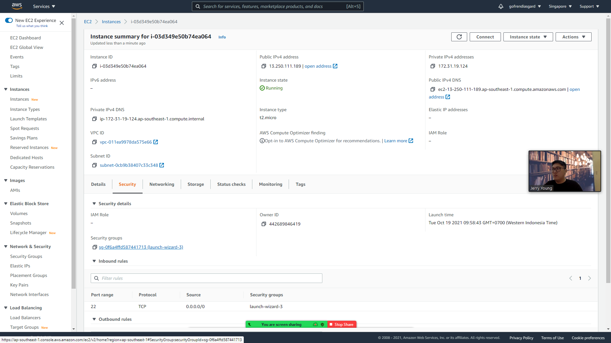
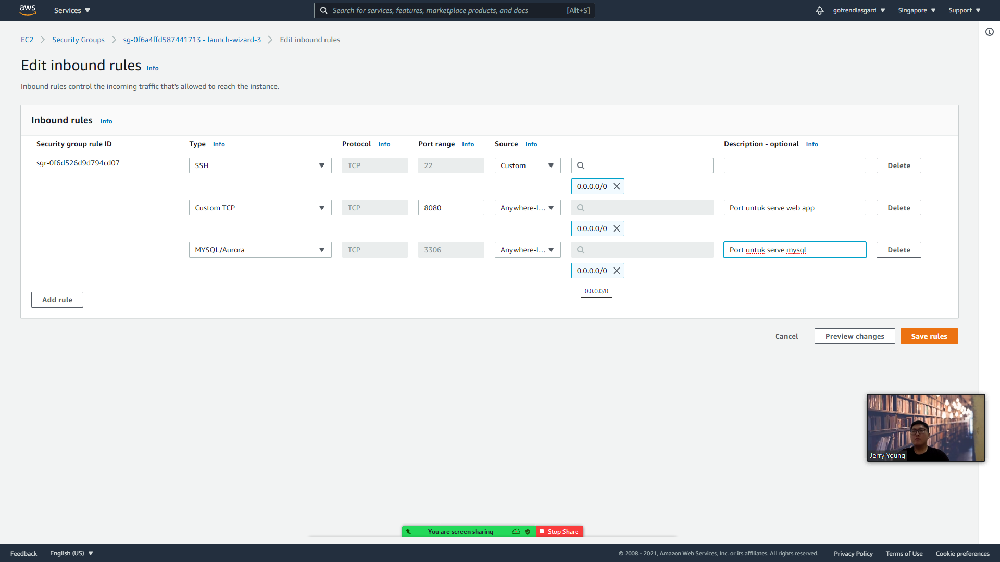

# Deployment

Perlu login via ssh ke VM:

```sh
# lenovo.pem adalah nama file permission (key-pair) yang sudah dibuat sebelumnya
ssh -i ~/lenovo.pem ubuntu@ec2-13-250-111-189.ap-southeast-1.compute.amazonaws.com
```

## [Sekali] Install docker

```sh
sudo apt-get update
sudo apt-get install docker.io
```

## [Sekali] Ubah hak akses socket

```sh
sudo chmod 777 /var/run/docker.sock
```

## [Sekali] Install docker-compose

```sh
sudo apt-get install python3-pip
sudo pip3 install docker-compose
```

## [Sekali] Buka security group untuk port 8080 & 33306

Klik pada bagian link security group



Tambahkan inbound rule



## [Sekali] Git clone

```sh
git clone https://github.com/goFrendiAsgard/alta-batch-3-ec2.git ~/app
```

## [Sekali] Install go

```sh
wget https://golang.org/dl/go1.17.2.linux-amd64.tar.gz
sudo rm -rf /usr/local/go 
sudo tar -C /usr/local -xzf go1.17.2.linux-amd64.tar.gz
export PATH=$PATH:/usr/local/go/bin
go version

echo 'PATH=$PATH:/usr/local/go/bin' >> ~/.bashrc
```

## [Setiap deploy] Git pull origin master

```sh
cd app
git pull origin main
```


## [Setiap deploy] go test ./..
## [Setiap deploy] docker-compose down
## [Setiap deploy] docker-compose up